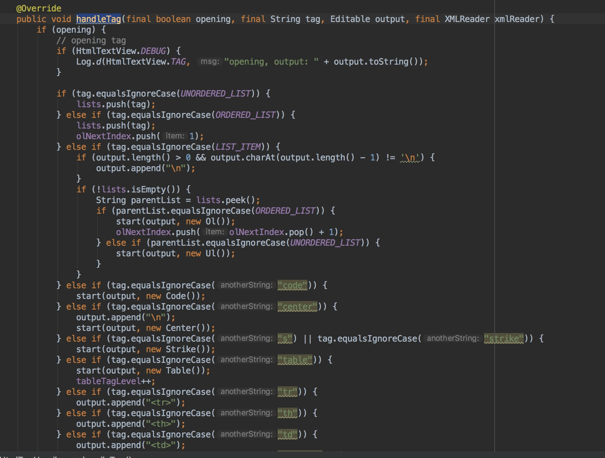
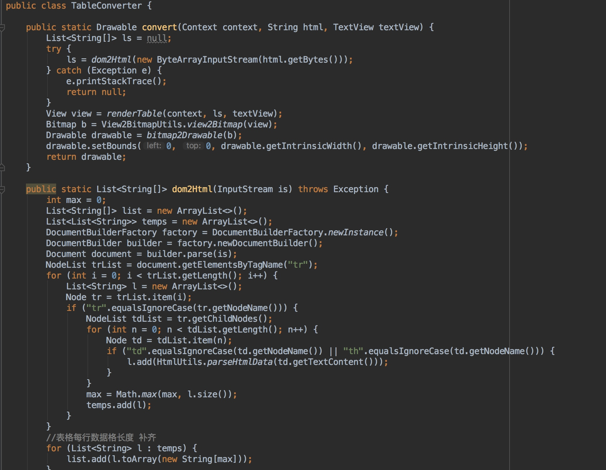
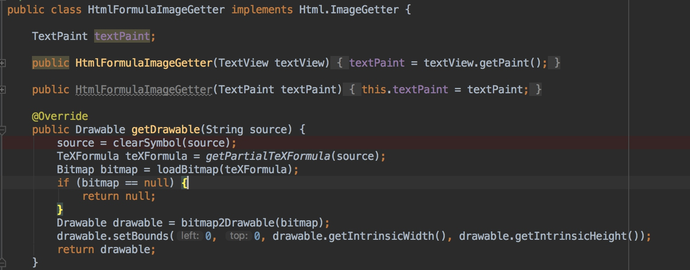

### 介绍
解析html标签进行布局的图文公式混排控件。
### 使用实例
```java
<org.sufficientlysecure.htmltextview.HtmlTextView
            android:id="@+id/tv"
            android:layout_width="match_parent"
            android:layout_height="wrap_content"
            android:textColor="#123456"
            android:textIsSelectable="false"
            android:textSize="16dp" />
            
HtmlTextView tv = findViewById(R.id.tv);
tv.setHtml(HtmlUtils.parseHtmlData(content));
```
> HtmlTextView渲染的是题干数据，即后台接口返回数据的content字段,取得content字段后直接转换赋值即可**tv.setHtml(HtmlUtils.parseHtmlData(content))**;


### 支持的html标签
* ``<p>``
* ``<div>`` 
* ``<br>``
* ``<b>``
* ``<i>``
* ``<strong>`` ([bug on some Android versions: generates italic](https://code.google.com/p/android/issues/detail?id=3473))
* ``<em>`` ([bug on some Android versions: generates bold](https://code.google.com/p/android/issues/detail?id=3473))
* ``<u>``
* ``<tt>``
* ``<dfn>``
* ``<sub>``
* ``<sup>``
* ``<blockquote>``
* ``<cite>``
* ``<big>``
* ``<small>``
* ``<font size="..." color="..." face="...">``
* ``<h1>``, ``<h2>``, ``<h3>``, ``<h4>``, ``<h5>``, ``<h6>``
* ``<a href="...">``
* ````
* ``<ul>``
* ``<ol>``
* ``<li>``
* ``<del>``
* ``<code>``
* ``<center>``
* ``<strike>``
* ``<table>``
* ``<tr>``
* ``<th>``
* ``<td>``
* ``<formula>``

### 原理
整个控件都是基于textview span的基础上进行拓展，对于不支持的html标签可以在**HtmlTagHandler**中拓展，html标签的解析是基于sax解析方式，详见**handleTag**方法。



``<table>``标签的二次拓展解析由于体量较小采用的是dom解析，然后绘制成图，详见TableConverter类。

``<formula>``标签是基于JLaTexMath库解析，详见HtmlFormulaImageGetter类。

由于android.text.html类属性传值不全的原因，自定义标如果需要获取属性(Attribute),只有通过反射获取，代码示例如下。
```java
/**
     * 利用反射获取html标签的属性值
     *
     * @param xmlReader
     * @param property
     * @return
     */
    private String getProperty(XMLReader xmlReader, String property) {
        try {
            Field elementField = xmlReader.getClass().getDeclaredField("theNewElement");
            elementField.setAccessible(true);
            Object element = elementField.get(xmlReader);
            Field attsField = element.getClass().getDeclaredField("theAtts");
            attsField.setAccessible(true);
            Object atts = attsField.get(element);
            Field dataField = atts.getClass().getDeclaredField("data");
            dataField.setAccessible(true);
            String[] data = (String[]) dataField.get(atts);
            Field lengthField = atts.getClass().getDeclaredField("length");
            lengthField.setAccessible(true);
            int len = (Integer) lengthField.get(atts);

            for (int i = 0; i < len; i++) {
                // 这边的property换成你自己的属性名就可以了
                if (property.equals(data[i * 5 + 1])) {
                    return data[i * 5 + 4];
                }
            }
        } catch (Exception e) {
            e.printStackTrace();
        }
        return null;
    }

```

### 感谢
powered by [html-Textview](https://github.com/PrivacyApps/html-textview) 、 [JLaTexMath-andriod](https://github.com/sixgodIT/JLaTexMath-andriod)


