#
LateX协议了解

##一、LateX协议前世
    · LaTeX是一种基于ΤΕΧ的排版系统，由美国计算机学家莱斯利·兰伯特（Leslie Lamport）在20世纪80年代初期开发，利用这种格式，即使使用者没有排版和程序设计的知识也可以充分发挥由TeX所提供的强大功能，能在几天，甚至几小时内生成很多具有书籍质量的印刷品。对于生成复杂表格和数学公式，这一点表现得尤为突出。因此它非常适用于生成高印刷质量的科技和数学类文档。这个系统同样适用于生成从简单的信件到完整书籍的所有其他种类的文档。类似于微软的word工具，也是一种排版工具。数学公式仅仅是LateX一点点小功能而已。
##二、LateX协议 基本数学语法
###1、$符号作用
    · 如果我们要插入一个公式，把公式放在$与$之间就可以了。如：  $a+b=c$ 。解析之后的图片如图：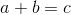
###2、上标
    ·   $2^32$        解析之后如图 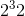
        · $2^{32}$     解析之后如图  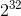
###3、下标
    ·    $2_32$   解析之后如图 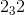
     ·   $2_{32}$   解析之后如图  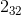
###4、根式
    ·    $\sqrt{a+b}$    解析之后如图  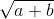
    ·   $\sqrt[3]{a+b}$     解析之后如图   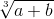
##三、Java实现
    · java实现开源库为jlatexmath，[github传送门](https://github.com/opencollab/jlatexmath)
    · 在（java代码为resource文件夹，android代码为assets文件夹）资源文件夹中，有xml的符号对照表。
    · 在org.scilab.forge.jlatexmath.core.TeXParser.java类文件中，为tex格式的解析代码。**过于复杂，不是专业人士请慎重阅读**
    · 核心思想为将输入的公式代码依靠TeXParser进行解析，依靠TeXIcon将公式绘制到图片上，生成一张公式图片。
##四、LateX对照表
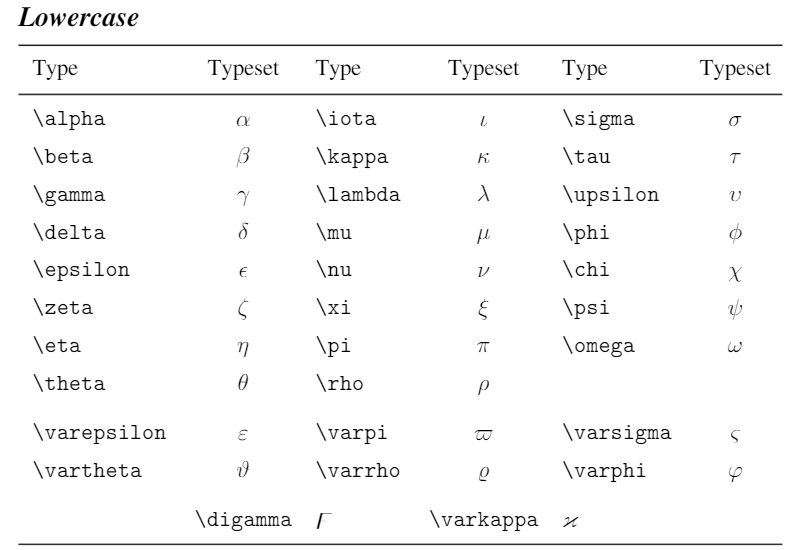
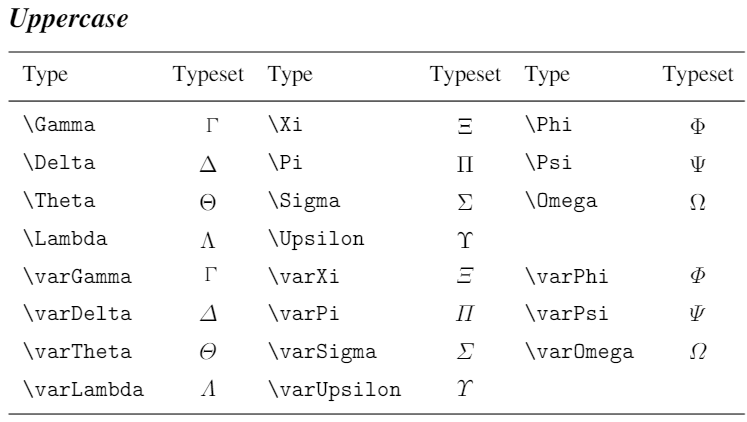
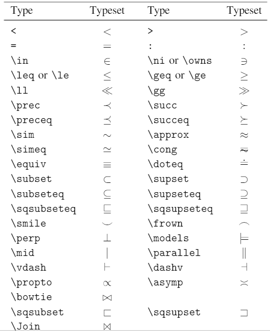
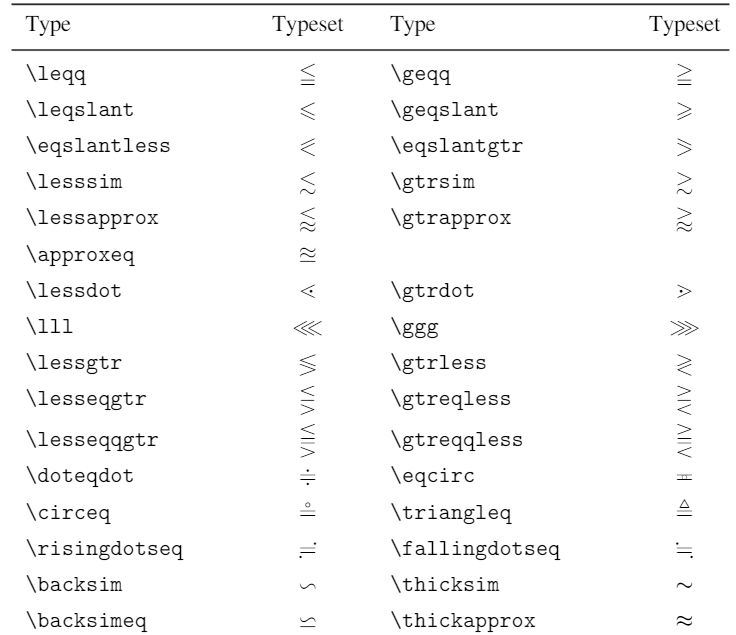
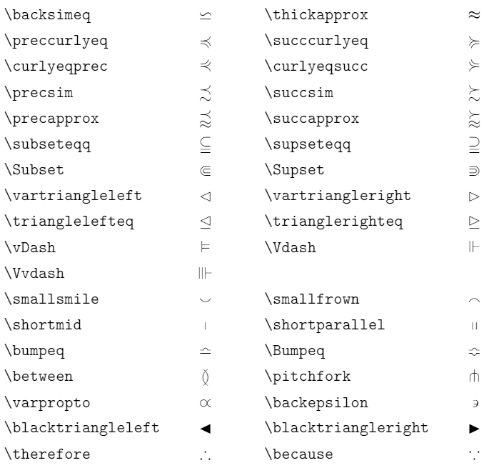
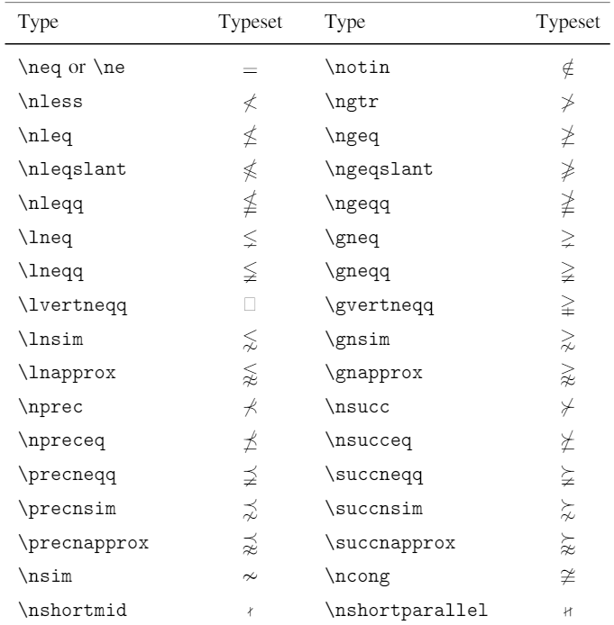
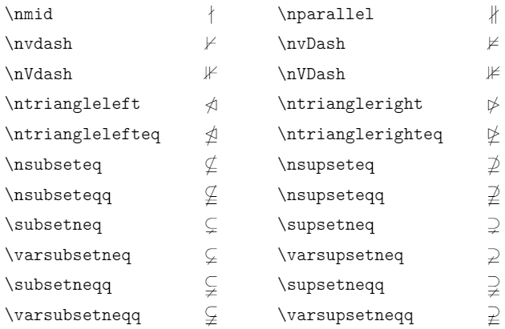
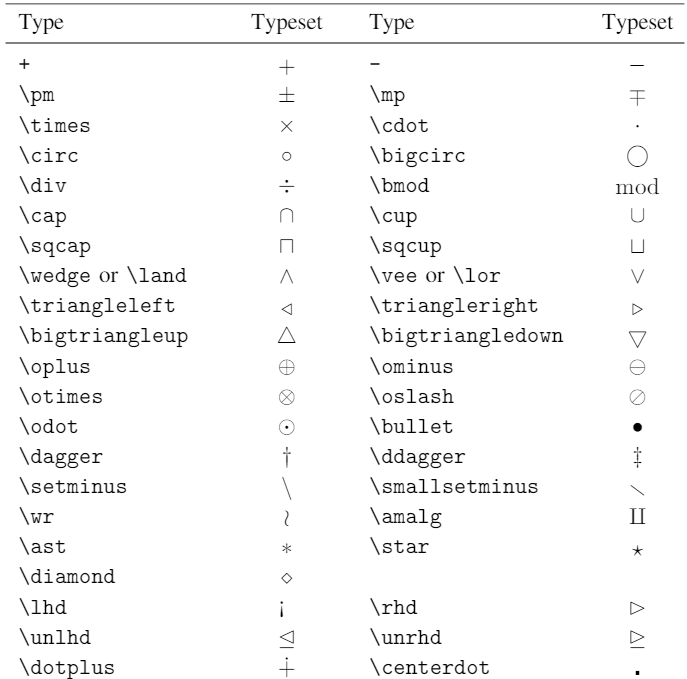
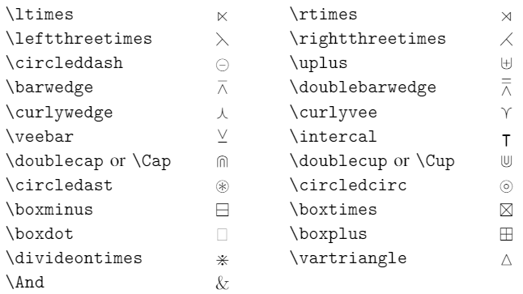
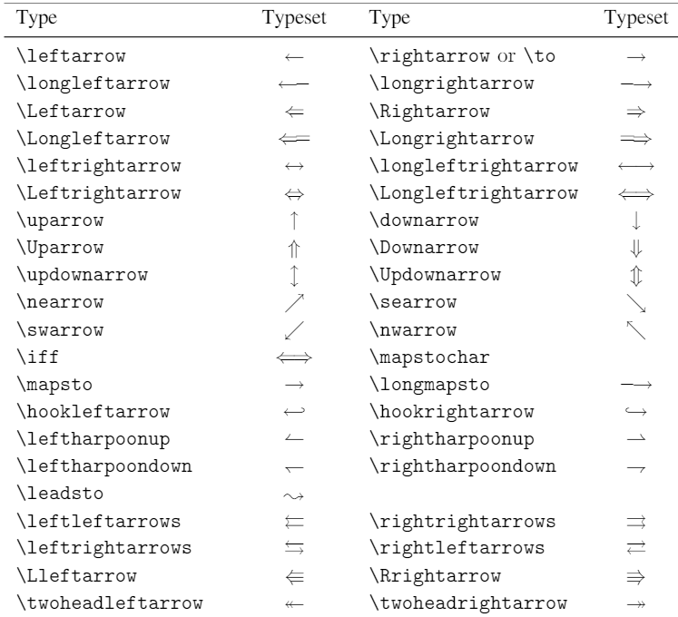
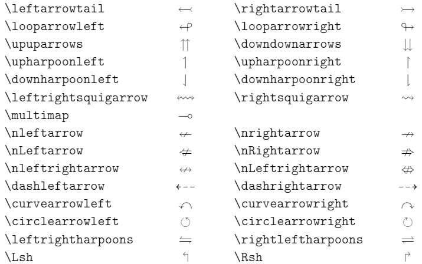
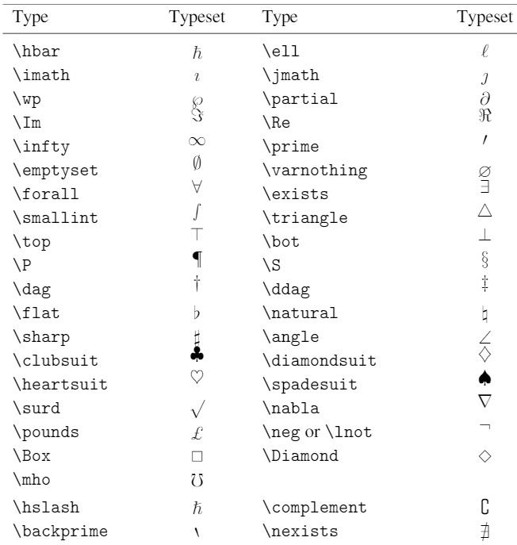
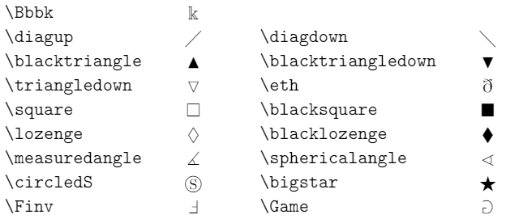
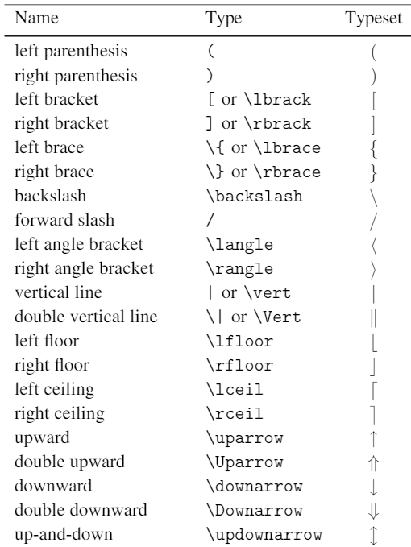
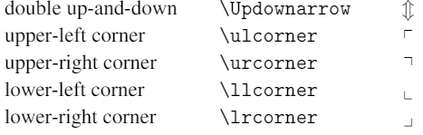
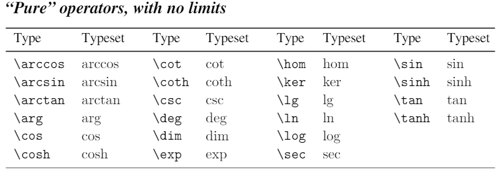
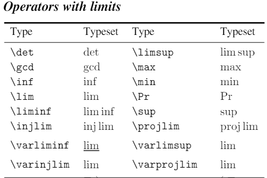
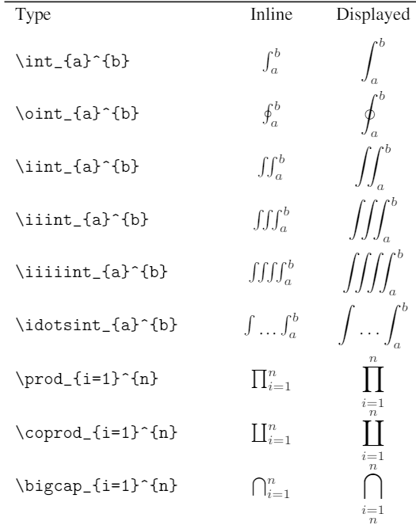
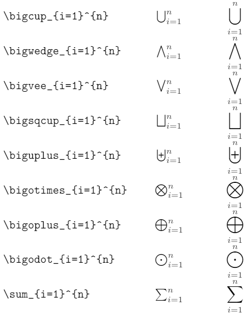
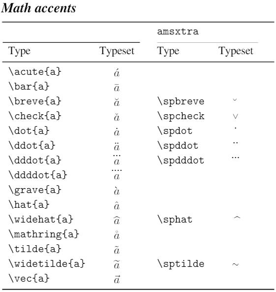
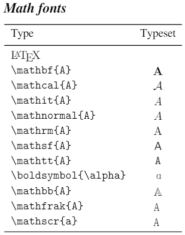
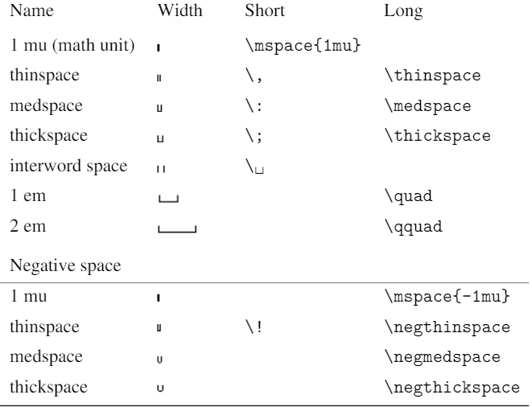
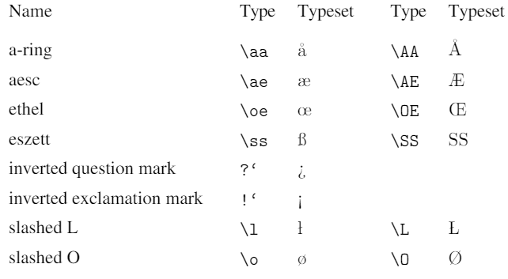
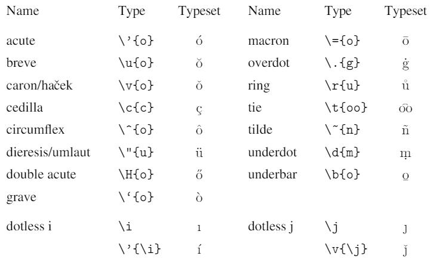
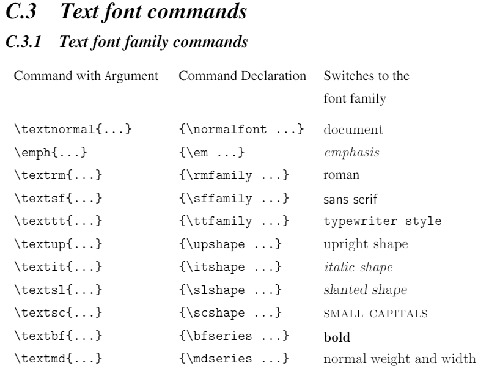
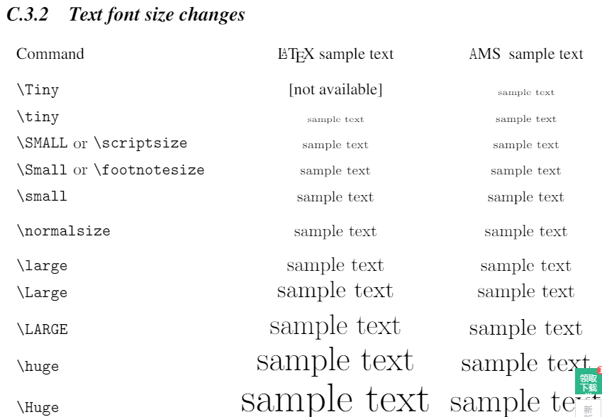